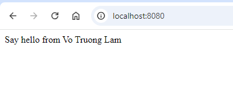

# Dockerfile Explanation

This Dockerfile defines a two-stage build process for building and running a Spring Boot application.

### Build Stage

```Dockerfile
# Build
FROM maven:3.8.8-eclipse-temurin-17-alpine AS builder
WORKDIR /app
COPY src ./src
COPY pom.xml .
RUN mvn clean install

# Run
FROM eclipse-temurin:17.0.9_9-jdk
WORKDIR /app
COPY --from=builder /app/target/demo-1.0.jar ./demo.jar
EXPOSE 8080
CMD ["java", "-jar", "demo.jar"]
```

### Define docker-compose.yml
```
version: '3.9'

services:
  app:
    container_name: demo-spring-boot
    build: .
    ports:
      - "8080:8080"
    environment:
      APP_AUTHOR: ${APP_AUTHOR}
```

### Define .env
```
APP_AUTHOR=Vo Truong Lam
```

### Execute Docker-compose
```
docker-compose up --build
```

# Result

